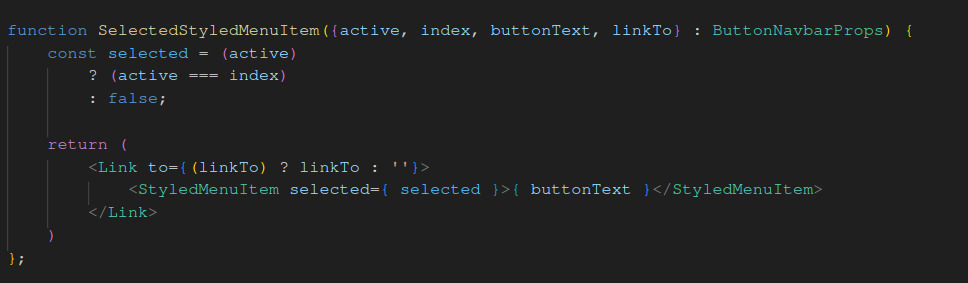
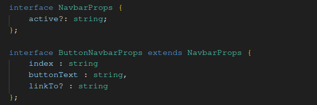
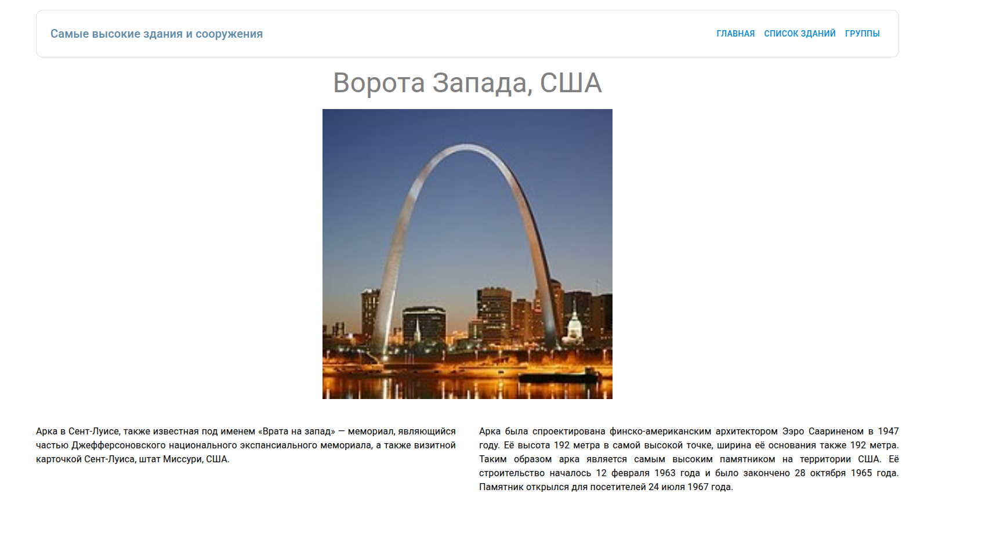
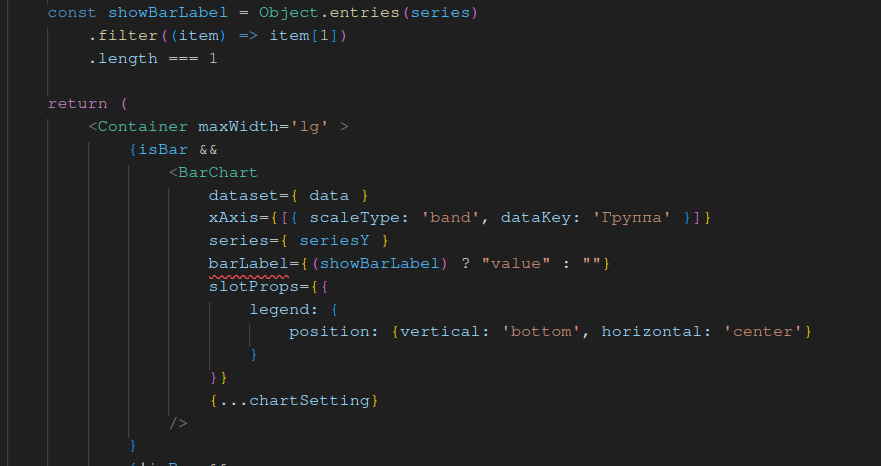
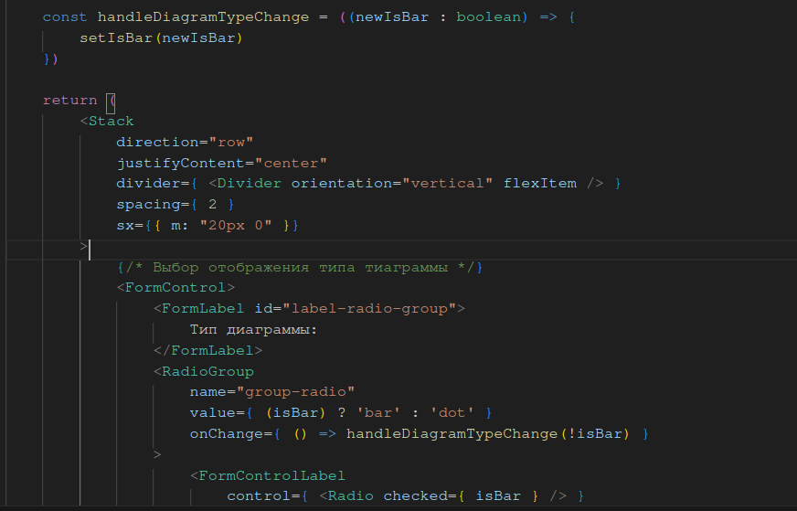
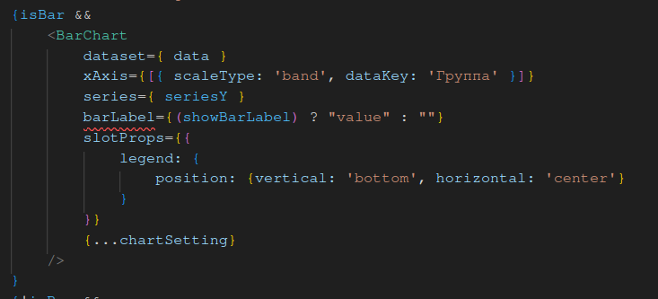

# Лабораторная работа №4

#### Первое самостоятельное задание (Отобрать сооружения по фильтру стр. 8)
-----

Прикреплено в файле Sorted_buildings.csv

Для получения результата нужно:

1. Выбрать колонки для отображения: "Название", "Тип", "Страна", "Высота"
2. Столбец "Тип" отфильтровать на наличие слова "мачта"
3. Сортировка по высоте - от большего к меньшему

#### Второе самостоятельное задание (Исправить Navbar стр. 10)
-----

В файле Navbar.tsx для таких целей (ещё в лабораторной работе 3) было сделано следующее

1. Сделан компонент SelectedStyledMenuItem который принимал:
    
    - active - число, номер выбранного элемента меню
    - index - номер меню в списке
    - buttonText - текс, отображаемый на кнопке меню
    - linkTo - (новое поле), ссылка для навигации

2. Если active === index, то подсвечиваем как выбранное, иначе - нет

Код компонента и пропсов:




#### Третье самостоятельное задание (Отображение информации об одном из зданий стр. 11)
-----

Для этого был сделан компонент Building, который объединет в себе следующее: 

- Компонент Navbar (без параметра - чтобы не отображалась кнопка)
- Приватный (т.к. не экспортировал) компонент BuildingCard - карточка с изображением здания, описанием

Код карточки и компонента Building:

```
const BuildingCard = ({structureId} : {structureId : number}) => {
    const title = structures[structureId].title
    const description = structures[structureId].description
    const img = structures[structureId].img

    return (
        <>
            <Box sx={{ padding: 2, maxWidth: "900px", margin: "auto" }}>
                <Typography variant="h3" gutterBottom sx={{ textAlign: 'center', color: 'gray' }}>
                    {title}
                </Typography>

                
            </Box>
            <Box mt={3} sx={{ display: 'flex', flexBasis: '100%', textAlign: 'justify', columnGap: 5}}>
                {description.map((text: string, index: number) => (
                <Typography key={index} variant="body1" paragraph sx={{ flexGrow: 1, flexShrink: 1, flexBasis: 0 }}>
                    {text}
                </Typography>
                ))}
            </Box>
        </>
    )
}

const Building = () => {
    const { structureId } = useParams<{ structureId : string }>()

    return (
        <div>
            <Navbar />
            <Container maxWidth='xl' >
                <BuildingCard structureId={ Number(structureId) } />
            </Container>
        </div>
    )
}
```

Результат:



#### Четвёртое самостоятельное задание (Отображение barLabel если выбран только один ряд стр. 22)
-----

Для этого нужно было модифицировать компонент GroupChart

1. Пробежался массив series и отфильтровал по значению ключа = true ```{"Максимальная высота" : true, "Минимальная высота" : false} => {"Максимальная высота" : true}```
2. Подсчитал кол-во записей, если 1, то true, иначе false
3. BarChart если кол-во записей 1, то значение = "value", иначе ""



#### Пятое самостоятельное задание (Переключение отображения диаграммы стр. 25)
-----

Для этого:

1. Определил состояние [isBar, setIsBar] в компоненте GroupChart
2. Тип пропсов SettingsChart расширил значениями выше
3. Передал в SettingsChart недостающие пропсы
4. Перехватчик, который обновлял значение isBar при изменении компонента RadioGroup
5. В компоненте RadioGroup в пропс onChange передал стрелочную функцию, которая при изменении компонента передавала значение !isBar в функцию-перехватчик
6. В компоненте GroupChart добавил условие для отрисовки диаграмм по состоянию isGroup

Пример кода:


Перехватчик и изменение состояния в RadioGroup


Отрисовка по состоянию isBar
