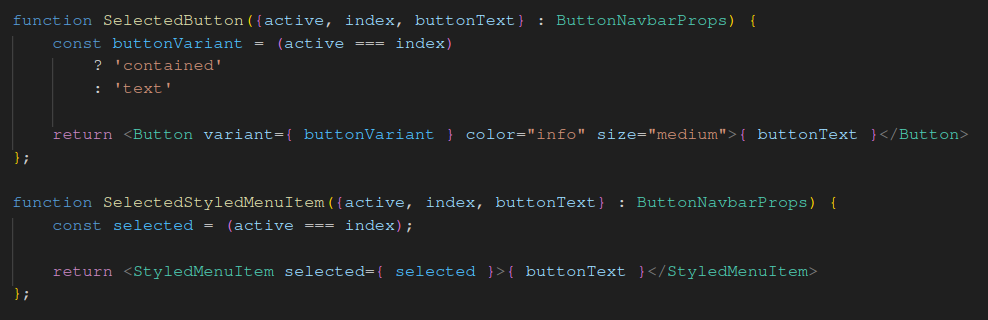
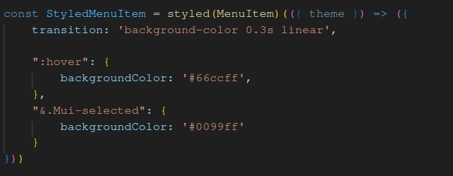
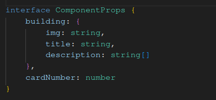
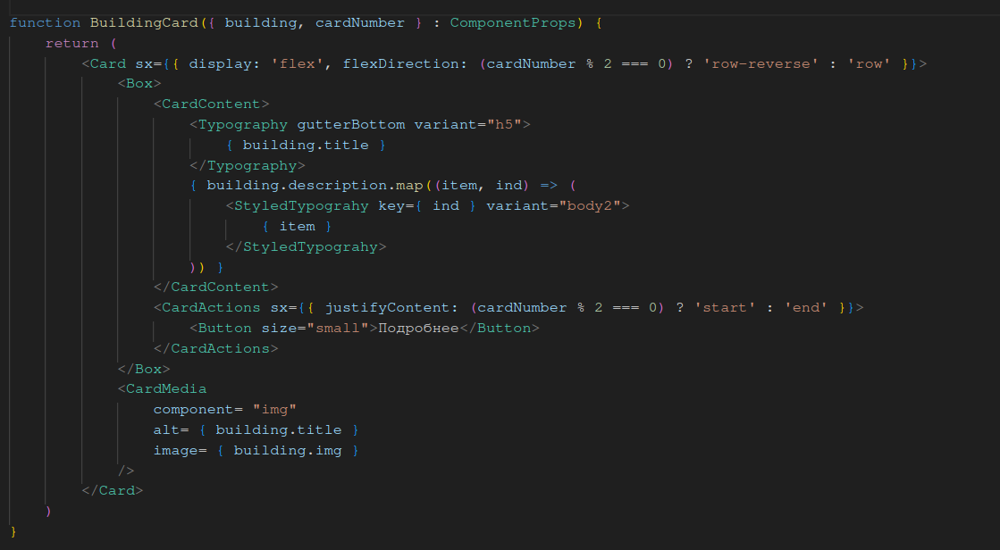
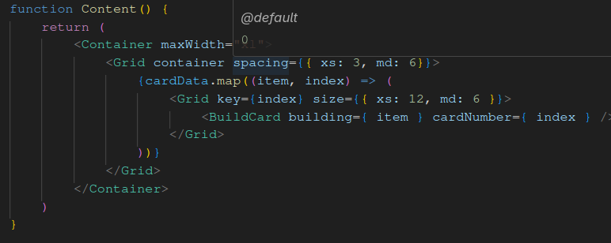
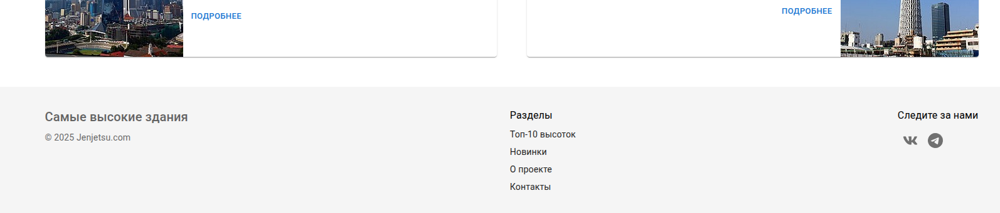
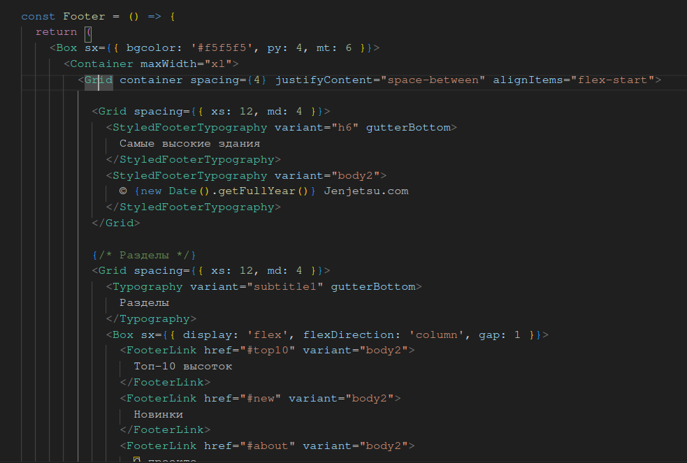

# Лабораторная работа № 3

#### Первое самостоятельное задание (Выделение пункта и эффект при наведении стр. 11)

Для этого:

1. Сделал компонент SelectedStyledMenuItem который принимает:
    
    - active - число, номер выбранного элемента меню
    - index - номер меню в списке
    - buttonText - текс, отображаемый на кнопке меню

2. Вынес в массив все названия кнопок в меню
3. Итерирую массив названий и на их основе создаю компонент SelectedStyledMenuItem

Аналогично было сделано и для кнопок не бургер-меню

Пример кода:

Для добавления эффекта изменения цвета при наведении следал следующее:

1. Создал компонент StyledMenuItem, в котором переопределил псевдокласс :hover на изменение цвета фона + повесил задержу для изменения цвета в 0.3 секунды
2. Для выбранной кнопки задал свой цвет (через псевдокласс у Mui-selected)

Пример кода:

---
#### Второе самостоятельное задание (Изменение компонентов Content и BuildCard стр. 20)

Для этого:

1. В файле BuildCard.tsx создал компонент StyledTypography для вывода описания здания
2. В компонент BuildCard добавил пропс, в котором передал номер карточки из компонента Content
3. В зависимости от номера карточки установить порядок вывода рисунка в карточку и положение кнопки Подробнее.

Пример кода:

Добавление нового значения в пропс

Зависимость от номера карточки установить порядок вывода рисунка в карточку и положение кнопки Подробнее

Передача нового значения в компоненте Content

---
#### Третье самостоятельное задание (Реализация компонента Footer)

Для этого:

1. Создал новый компонент Footer
2. Разделил место на 3 колонки

    - Первая с краткой информации и знаком копирайта
    - Вторая с кликабельными разделами
    - Третья с кликабельными значками соц. сетей
3. Для соц. сетей установил либу @mui/icons-material , в которых и содержатся svg иконки соц сетей

Пример футера:

Пример кода:

Основная часть кода находится в /components/Footer.tsx